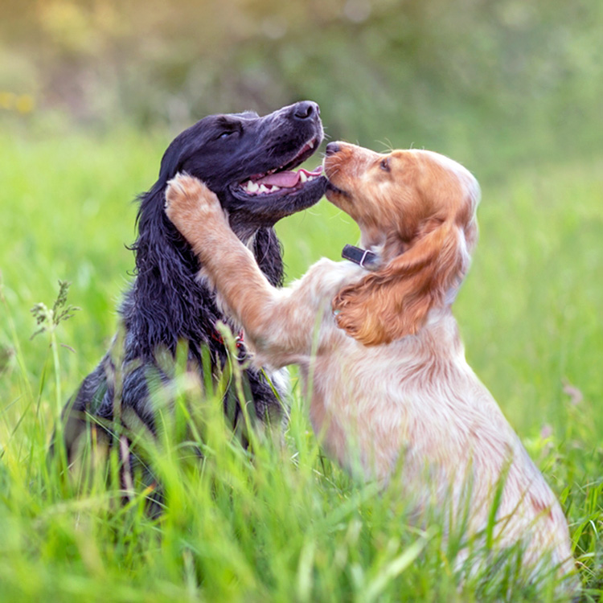

<div align="center">
  

  # 🐶 Dog Breed Detector Application

  **An intelligent, AI-powered web application that identifies dog breeds instantly from images.**

  [](https://nextjs.org/)
  [](https://react.dev/)
  [](https://www.typescriptlang.org/)
  [](https://tailwindcss.com/)
  [](https://gradio.app/)
  [](https://groq.com/)
</div>

<br />

## 🌟 Overview

The Dog Breed Detector is a fast, responsive, and visually stunning web application built to help dog lovers, shelter workers, and curious pet owners identify dog breeds with just a single photo. 

Leveraging state-of-the-art AI models via **Gradio** and high-performance LLM insights powered by **Groq**, this platform not only predicts the breed with high confidence but also provides rich, detailed information about the dog's characteristics, history, and care requirements.

### ✨ Key Features

- **📸 Instant Breed Identification**: Upload an image or drag-and-drop a photo to get immediate AI predictions.
- **🧠 Intelligent Insights**: Get comprehensive details about the predicted breed, generated dynamically using the LLaMA 3 model via Groq API.
- **🗺️ Interactive Origins Map**: Visualize the geographical origin of different dog breeds on an interactive world map.
- **🎨 Modern UI/UX**: A beautiful, accessible, and highly responsive interface crafted with Tailwind CSS and Radix UI components (Shadcn UI).
- **📱 Fully Responsive**: Seamlessly works on desktop, tablet, and mobile devices.
- **⚡ Built for Speed**: Developed with Next.js App Router for optimal performance and SEO.

---

## 🛠️ Technology Stack

| Category | Technologies Used |
| :--- | :--- |
| **Framework** | Next.js 14, React 19 |
| **Language** | TypeScript |
| **Styling** | Tailwind CSS, Framer Motion (Animations) |
| **Components** | Radix UI, Shadcn UI |
| **AI Integration** | `@gradio/client` (Computer Vision), `groq-sdk` (LLM Insights) |
| **Data Visualization**| `react-simple-maps`, `d3-geo` (Interactive Maps) |

---

## 🚀 Getting Started

Follow these instructions to get a copy of the project up and running on your local machine.

### Prerequisites

Ensure you have the following installed:
- [Node.js](https://nodejs.org/) (v18.17 or higher)
- npm, yarn, or pnpm

### Environment Variables

You will need a **Groq API Key** to generate the detailed breed descriptions.
Create a `.env.local` file in the root directory and add your key:

```env
GROQ_API_KEY=your_groq_api_key_here
```

*(Note: Never commit your `.env.local` file to version control.)*

### Installation

1. Clone the repository:
   ```bash
   git clone https://github.com/suryakathyakeyaboddi-creator/dog-breed-application-detector-.git
   ```

2. Navigate into the project directory:
   ```bash
   cd dog-breed-application-detector-
   ```

3. Install the dependencies:
   ```bash
   npm install
   # or
   yarn install
   ```

4. Start the development server:
   ```bash
   npm run dev
   # or
   yarn dev
   ```

5. Open your browser and visit: `http://localhost:3000`

---

## 🌐 Deployment

This project is optimized for deployment on [Vercel](https://vercel.com/). 

1. Push your code to GitHub.
2. Import the project into Vercel.
3. Add the `GROQ_API_KEY` to the Environment Variables in the Vercel dashboard.
4. Deploy!

*(Note: The project includes a `.npmrc` file with `legacy-peer-deps=true` to resolve specific React 19 package compatibility issues within the Vercel build environment.)*

---

## 📸 Screenshots & Gallery

*(Sample images included in the `public/images` directory)*
- `71mK0IQZwiL._UF1000,1000_QL80_.jpg`
- `GettyImages-922841020-e4bf98b5345042c0b04b3884a2ed91a4.jpg`
- `images.webp`

---

## 🤝 Contributing

Contributions, issues, and feature requests are welcome!
Feel free to check the [issues page](https://github.com/suryakathyakeyaboddi-creator/dog-breed-application-detector-/issues).

---

<div align="center">
  <p>Built with ❤️ for dogs and developers.</p>
</div>
